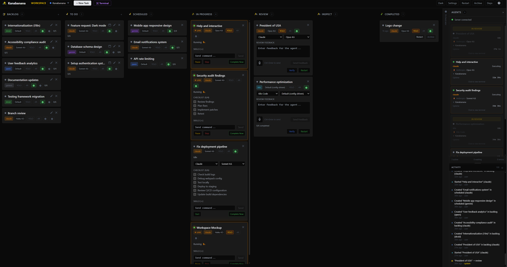

<div align="center">
  
</div>

# Kanabanana

> Self-hosted Kanban board with built-in AI agent orchestration for software development

[](LICENSE)
[](https://github.com/bartsecond/Kanaban/actions/workflows/ci.yml)

Kanabanana lets you create tasks on a Kanban board, assign AI agents to them, and watch them execute autonomously. Review the results, send feedback, or let the orchestrator sequence work for you.

## Why Kanabanana?

When working across multiple repositories, it's common to have a dozen Claude Code sessions, Gemini terminals, and other agent windows scattered across your screen. Each one runs in its own terminal, doing its own thing — and keeping track of what's running where, what finished, what needs review, and what's blocked becomes a real problem. Tasks get lost. Context gets fragmented. You spend more time juggling windows than making progress.

**Kanabanana puts everything in one place.** One browser tab. One board. Every task, every agent, every repository — visible, trackable, and controllable from a single screen.

- **Nothing gets lost.** Every task is on the board. Every agent's terminal output is captured and streamable. Every walkthrough is logged automatically.
- **One screen, full visibility.** Instead of 20 terminal windows, you have one Kanban board showing the status of every task across every project.
- **No context-switching for feedback.** When an agent finishes, the task moves to Review. Read the walkthrough, send feedback, and the agent picks up right where it left off — no re-opening terminals or hunting for sessions.
- **Multi-repo, multi-agent.** Workspaces isolate tasks per repository. Different tasks can use different agents — Claude for one repo, Gemini for another, a local model for a third — all managed from the same board.
- **Dependency-aware orchestration.** The orchestrator chains tasks together, automatically spawning the next agent when prerequisites complete.

## How It Works

1. **Create a task** on the board with a title, description, and optional checklist
2. **Assign an AI agent** (Claude, Kilo Code, Gemini, or a local LM Studio model)
3. **The agent spawns** in a real PTY terminal, receives the task as a prompt, and starts working
4. **Watch it live** — terminal output streams to the browser in real time via WebSocket
5. **Review the output** — the board moves the task to Review when the agent finishes, with auto-verification and walkthrough generation
6. **Send feedback** — if something needs fixing, send feedback directly and the agent resumes where it left off

The optional **orchestrator** can sequence multiple tasks automatically, spawning agents in dependency order and coordinating work across the board.

## Features

- **7-column workflow** — Backlog, To Do, Scheduled, In Progress, Review, Inspect, Done
- **Multi-agent support** — Claude, Kilo Code, Gemini, and LM Studio (local models)
- **AI orchestrator** — Autonomous task sequencing and agent coordination
- **Task scheduling** — One-time and recurring schedules with max execution limits
- **Real-time board** — Drag-and-drop with live WebSocket updates
- **Skills system** — Reusable command templates executable with one click
- **MCP server** — Model Context Protocol integration for Claude
- **Workspaces** — Isolate tasks into separate project boards
- **Auto-verification** — AI self-reviews agent output before completion
- **Walkthrough generation** — Automatic step-by-step logs of agent work
- **GitHub integration** — PR and issue tracking from the board
- **Voice input** — Dictate task descriptions via Whisper API
- **4 themes** — Dark, Light, Banana Dark, Banana Light

## Supported Agents

| Agent | CLI Required | Notes |
|-------|-------------|-------|
| **Claude Code** | `claude` (Claude Code CLI) | Default agent. Supports `--continue` for feedback resumption |

## Quick Start

**Prerequisites:** Node.js 18+ and npm (see [CONTRIBUTING.md](CONTRIBUTING.md) for native build requirements)

```bash
# Clone the repository
git clone https://github.com/bartsecond/Kanaban.git
cd Kanaban

# Install dependencies
npm install
cd client && npm install && cd ..

# Start development server
npm run dev
```

**Windows users:** Double-click `start.bat` to launch all three services (server, client, and Whisper) in one terminal window — no command line needed.

The app will be available at `http://localhost:5173` (Vite dev server) with the API running on `http://localhost:3001`.

## Available Scripts

| Script | Description |
|--------|-------------|
| `npm run dev` | Start server + client concurrently |
| `npm run dev:server` | Start Express server only (port 3001) |
| `npm run dev:client` | Start Vite dev server only (port 5173) |
| `npm run dev:all` | Start server + client + Whisper transcription server |
| `npm run build` | Build the client for production |
| `npm start` | Start the server in production mode |
| `npm run db:reset` | Delete the SQLite database and restart fresh |

## Configuration

Most configuration is done through the **Settings** panel in the app (gear icon, top-right):

| Tab | What it configures |
|-----|-------------------|
| Appearance | Theme, card style, terminal position |
| Models | Default agent type and model per agent |
| Verification | Auto-verification behavior and retry limits |
| Sound | Audio feedback presets for task events |
| Tags | Custom tags with 16 color options |
| Templates | Reusable task configurations |
| GitHub | Personal access token for integration |

No environment variables are required for basic usage. The app runs with sensible defaults out of the box.

### Environment Variables (optional)

| Variable | Default | Description |
|----------|---------|-------------|
| `KANABAN_API_PORT` | `3001` | Port for the Express API server |
| `KANABAN_WHISPER_PORT` | `3002` | Port for the Whisper transcription server |

## MCP Server

Kanabanana includes an MCP (Model Context Protocol) server that lets Claude interact with your board programmatically — creating tasks, updating status, reading walkthroughs, and more.

```bash
# Install MCP server dependencies
cd mcp-server && npm install && cd ..
```

Add it to your Claude configuration (`claude_desktop_config.json` or `.claude/settings.json`):

```json
{
  "mcpServers": {
    "kanaban": {
      "command": "node",
      "args": ["path/to/Kanaban/mcp-server/index.js"],
      "env": {
        "KANABAN_API": "http://localhost:3001"
      }
    }
  }
}
```

## Tech Stack

| Layer | Technology |
|-------|-----------|
| Frontend | React 18, Vite, Tailwind CSS, TypeScript |
| Backend | Express, Socket.IO, TypeScript |
| Database | SQLite via better-sqlite3 |
| Terminal | @lydell/node-pty for agent process management |
| MCP | Model Context Protocol server (stdio) |

## Screenshots



> The Kanabanana board with multiple AI agents running tasks across workspaces.

## Project Structure

```
Kanaban/
  client/          # React frontend (Vite)
  server/          # Express backend + WebSocket
    routes/        # REST API endpoints
    parsers/       # Agent output parsers
  mcp-server/      # MCP server for Claude integration
  data/            # SQLite database + walkthroughs (gitignored)
  docs/            # Design specs and plans
```

## Contributing

Contributions are welcome! See [CONTRIBUTING.md](CONTRIBUTING.md) for setup instructions, code style, and how to submit a pull request.

## Acknowledgments

Built with these excellent open-source projects:

- [Express](https://expressjs.com/) — HTTP server
- [Socket.IO](https://socket.io/) — Real-time WebSocket communication
- [better-sqlite3](https://github.com/WiseLibs/better-sqlite3) — SQLite driver
- [@lydell/node-pty](https://github.com/lydell/node-pty) — Terminal process management
- [@hello-pangea/dnd](https://github.com/hello-pangea/dnd) — Drag and drop
- [xterm.js](https://xtermjs.org/) — Terminal emulator in the browser
- [Tailwind CSS](https://tailwindcss.com/) — Utility-first CSS

## License

This project is licensed under the [Business Source License 1.1](LICENSE).

**What you can do:**
- Use it for personal projects, education, research, and evaluation
- Run a single production instance for any purpose (including commercial)
- Modify and create derivative works

**What you can't do:**
- Offer it as a hosted/managed service to third parties
- Redistribute it as a competing product

On **2030-03-16**, the license converts to **MIT** — fully open source, no restrictions.
